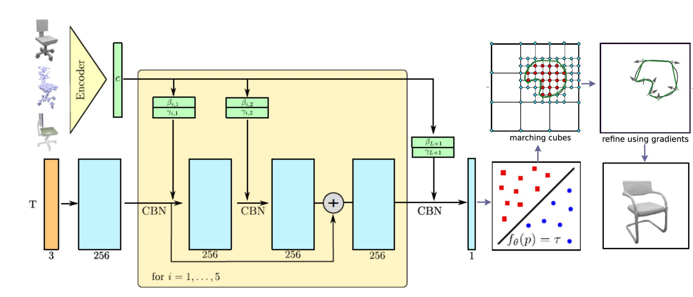
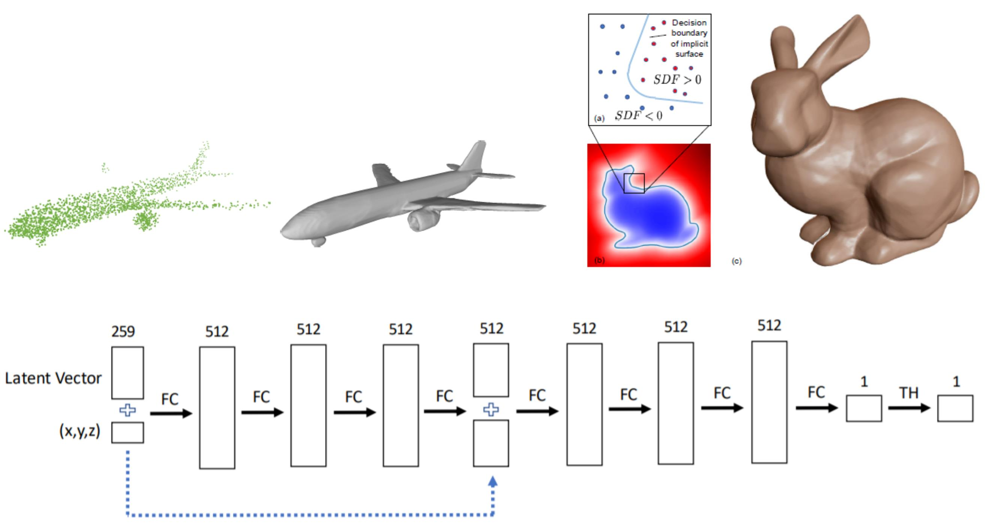

# 3DV-Implicit-Reconstruction
Explore Various Encodings for Implicit Scene Reconstruction

## Papers with code

### 3D Reconstruction using implict function

#### ONet
[[paper]](https://github.com/YuePanEdward/3DV-Implicit-Reconstruction/blob/master/implict_reconstruction_literature/ONet.pdf)  [[supplement]](https://github.com/YuePanEdward/3DV-Implicit-Reconstruction/blob/master/implict_reconstruction_literature/ONet_supplementary.pdf) [[codes(pytorch)]](https://github.com/autonomousvision/occupancy_networks) [[notes(chinese)]](https://hideoninternet.github.io/2019/12/21/b040bbb5/)

------

#### TSRNet
[[paper]](https://github.com/YuePanEdward/3DV-Implicit-Reconstruction/blob/master/implict_reconstruction_literature/TSRNet.pdf)

------

#### DeepSDF
[[paper]](https://github.com/YuePanEdward/3DV-Implicit-Reconstruction/blob/master/implict_reconstruction_literature/DeepSDF.pdf) [[codes(pytorch)]](https://github.com/facebookresearch/DeepSDF) [[notes(chinese)]](https://www.jianshu.com/p/a5a068345804)

 

------

### 3D Encoding methods

#### Tangent Convolution
[[paper]](https://github.com/YuePanEdward/3DV-Implicit-Reconstruction/blob/master/implict_reconstruction_literature/Tangent-convolutions.pdf) [[codes(tensorflow)]](https://github.com/tatarchm/tangent_conv) [[notes(chinese)]](https://github.com/youkenhou/note-about-tangent_conv)

------

####  PVCNN
[[paper]](https://github.com/YuePanEdward/3DV-Implicit-Reconstruction/blob/master/implict_reconstruction_literature/PVCNN.pdf) [[codes(pytorch)]](https://github.com/mit-han-lab/pvcnn)

------

####  MLH-MVCNN
[[paper]](https://github.com/YuePanEdward/3DV-Implicit-Reconstruction/blob/master/implict_reconstruction_literature/MLH-MVCNN.pdf) [[codes(pytorch)]](https://github.com/krips89/mlh_mvcnn)

------

## Datasets

#### [ModelNet](http://modelnet.cs.princeton.edu/#)

------

#### [ShapeNet](https://www.shapenet.org/)

------

#### [ScanNet](http://www.scan-net.org/)

------

#### [SceneNet](https://robotvault.bitbucket.io/)

## Useful links

#### [Machine Perception @ETH](https://ait.ethz.ch/teaching/courses/2019-SS-Machine-Perception/)

#### [3DV @ETH](https://www.cvg.ethz.ch/teaching/3dvision/)

## TSRNet reproduction 
