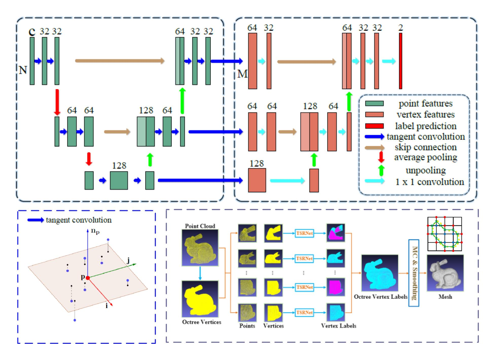
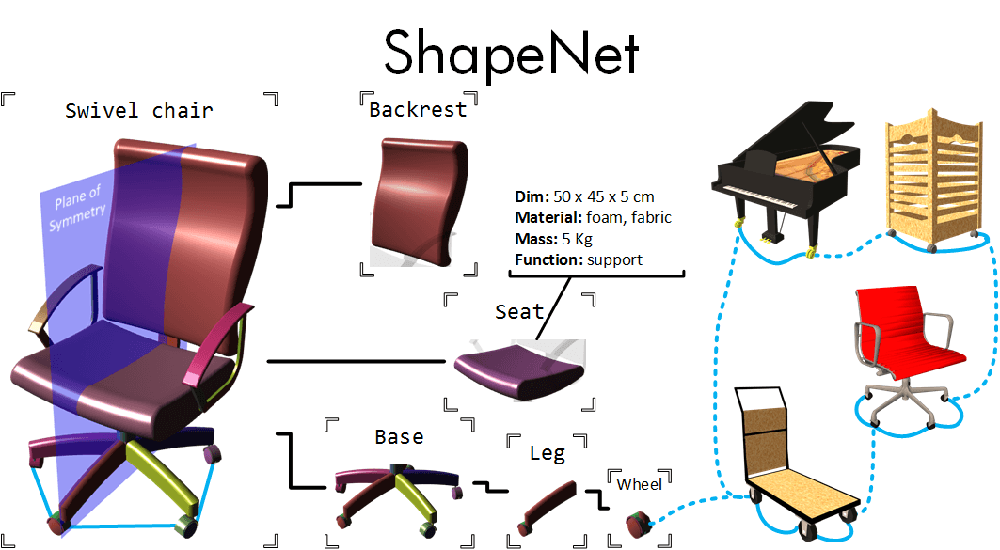
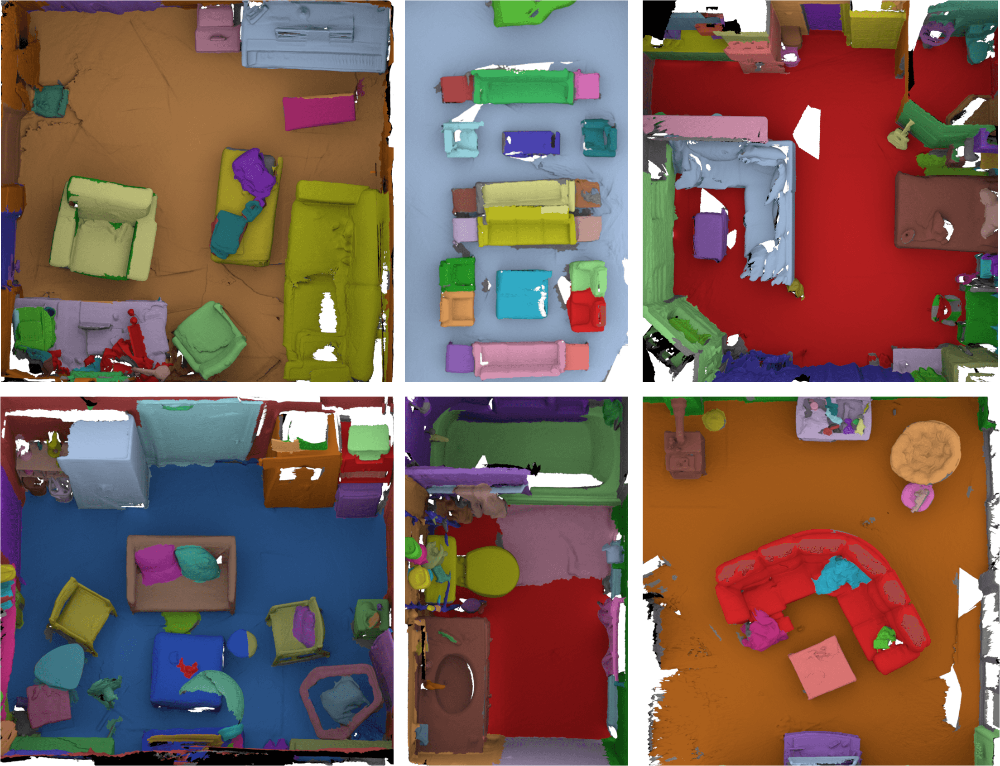

# 3DV-Implicit-Reconstruction
Explore Various Encodings for Implicit Scene Reconstruction

## Papers with code

### 3D Reconstruction using implict function

#### ONet
[paper](https://github.com/YuePanEdward/3DV-Implicit-Reconstruction/blob/master/implict_reconstruction_literature/ONet.pdf)  [supplement](https://github.com/YuePanEdward/3DV-Implicit-Reconstruction/blob/master/implict_reconstruction_literature/ONet_supplementary.pdf) [codes(pytorch)](https://github.com/autonomousvision/occupancy_networks)

------

#### TSRNet
[paper](https://github.com/YuePanEdward/3DV-Implicit-Reconstruction/blob/master/implict_reconstruction_literature/TSRNet.pdf)

------

#### DeepSDF
[paper](https://github.com/YuePanEdward/3DV-Implicit-Reconstruction/blob/master/implict_reconstruction_literature/DeepSDF.pdf) [codes(pytorch)](https://github.com/facebookresearch/DeepSDF)

------

### 3D Encoding methods

#### Tangent Convolution
[paper](https://github.com/YuePanEdward/3DV-Implicit-Reconstruction/blob/master/implict_reconstruction_literature/Tangent-convolutions.pdf) [codes(tensorflow)](https://github.com/tatarchm/tangent_conv) [notes](https://github.com/youkenhou/note-about-tangent_conv)

------

####  PVCNN
[paper](https://github.com/YuePanEdward/3DV-Implicit-Reconstruction/blob/master/implict_reconstruction_literature/PVCNN.pdf) [codes(pytorch)](https://github.com/mit-han-lab/pvcnn)

------

####  MLH-MVCNN
[paper]() [codes(pytorch)](https://github.com/krips89/mlh_mvcnn)

------

## Datasets

#### [ModelNet](http://modelnet.cs.princeton.edu/#)

------

#### [ShapeNet](https://www.shapenet.org/)

------

#### [ScanNet](http://www.scan-net.org/)

------

#### [SceneNet](https://robotvault.bitbucket.io/)

## TSRNet reproduction 
